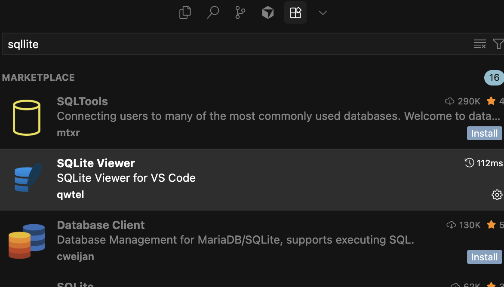

# 모델 생성하기

블로그앱에 포스트와 댓글을 생성하고 조회하려면 데이터를 등록해야합니다.  
데이터를 등록하기 위해서는 먼저 생성할 정보에 대해 어떤 정보들을 저장할지 정의해야합니다.  
장고에서는 이를 **모델**이라고 합니다.  

## 모델이란?
모델은 데이터를 담는 **상자**와 같습니다. 예를 들어:
- 포스트 상자에는 제목, 내용, 작성자 등의 정보가 들어갑니다
- 댓글 상자에는 댓글 내용, 작성자, 작성 시간 등의 정보가 들어갑니다


## 모델 생성하기
`posts/models.py` 파일을 열어서 아래 코드를 추가합니다.  
```python
from django.db import models
from django.contrib.auth.models import User

class Post(models.Model):
    author = models.ForeignKey(User, on_delete=models.CASCADE, verbose_name='작성자')
    title = models.CharField(max_length=200, verbose_name='제목')
    content = models.TextField(verbose_name='내용', help_text='내용을 입력해주세요.')
    created_at = models.DateTimeField(auto_now_add=True, verbose_name='작성일')
    updated_at = models.DateTimeField(auto_now=True, verbose_name='수정일')
```

### 코드 설명
- `author`: 포스트를 작성한 사람 (User 모델과 연결)
- `title`: 포스트의 제목 (최대 200자까지)
- `content`: 포스트의 내용 (길이 제한 없음)
- `created_at`: 포스트가 처음 작성된 시간 (자동으로 현재 시간 설정)
- `updated_at`: 포스트가 마지막으로 수정된 시간 (자동으로 현재 시간 설정)

이렇게 Post 모델을 정의했다면, 이제 데이터베이스에 적용해야합니다.  
그러기 위해서는 2가지 명령어를 실행해야합니다.

## 모델 마이그레이션 실행하기
**마이그레이션**은 모델을 데이터베이스에 적용하기 위한 설계도와 같습니다.

아래의 명령어를 실행하면, 장고가 데이터베이스에 적용하기 위한 파일을 생성합니다.
```bash
python3 manage.py makemigrations
```
`posts/migrations/0001_initial.py` 파일이 생성됩니다.
`0001_initial.py` 파일을 보면,  
내가 생성하려는 모델을 DB가 어떤 테이블로 생성할지 상세히 정의되어 있습니다.

## 모델 마이그레이션 적용하기
아래의 명령어를 실행하면, 데이터베이스에 실제로 테이블을 생성합니다.
```bash
python3 manage.py migrate
```
이제 데이터베이스에 포스트 테이블이 생성되었습니다.


## 생성한 모델 확인하기
어드민 페이지에 접속해봅시다.  
포스트 모델을 데이터베이스에 적용했지만, 어드민 페이지에서 확인할 수 없습니다.  

### 데이터베이스 직접 확인하기
에디터에서 **SQLite Viewer Extension**을 설치해봅시다.


이 도구를 설치 후, `db.sqlite3` 파일을 선택하면, 데이터베이스를 확인할 수 있습니다.  


직접 확인해보니, posts 테이블이 정상적으로 생성된 것을 확인할 수 있습니다.

그렇다면 왜 어드민 페이지에서 확인할 수 없을까요?  
이는 어드민 페이지에 포스트 모델을 등록하지 않았기 때문입니다.  

## 어드민 페이지에 모델 등록하기
어드민 페이지에 포스트 모델을 등록하려면, `posts/admin.py` 파일을 열어서 아래 코드를 추가합니다.
```python
from django.contrib import admin
from posts.models import Post

admin.site.register(Post)
```
### 이제 어드민 페이지에 접속해보면, 포스트 모델이 등록된걸 확인할 수 있습니다.  


## 직접해보기
이제 댓글 모델을 스스로 생성해보세요.  
`posts/models.py` 파일을 열어서 모델을 정의하면 됩니다.

### 댓글 모델 생성 힌트
댓글에는 어떤 정보가 필요할까요?
- 댓글 내용
- 댓글 작성자
- 댓글 작성 시간
- 어떤 포스트에 달린 댓글인지 (포스트와 연결)

모델 생성 형식은 아래와 같습니다.  
```python
class {모델이름}(models.Model):
    {필드이름} = models.{타입}(verbose_name='{필드이름(옵션)}', help_text='{필드설명(옵션)}')
```


### 데이터 타입
| 데이터 타입 | Django 필드 | 설명 | 예시코드 |
|------------|-------------|------|------|
| 숫자 | IntegerField | 정수 저장 | models.IntegerField() |
| 문자 | CharField | 짧은 텍스트 저장 (필수적으로 max_length 옵션 필요) | models.CharField(max_length=200) |
| 일시 | DateTimeField | 날짜와 시간 저장 | models.DateTimeField() |
| 텍스트 | TextField | 긴 텍스트 저장 | models.TextField() |
| 외래키(연결 필드) | ForeignKey | 다른 모델과 연결 (필수적으로 on_delete 옵션 필요) | models.ForeignKey(User, on_delete=models.CASCADE) |
| 참/거짓 | BooleanField | True/False 값 저장 | models.BooleanField() |

### 옵션
| 옵션 | 설명 | 예시코드 |
|------------|-------------|------|
| verbose_name | 필드의 이름 | verbose_name='제목' |
| help_text | 필드의 설명 | help_text='제목을 입력해주세요.' |
| on_delete | 외래키 삭제 시 처리 방법 | on_delete=models.CASCADE |
| null | 필드의 값을 null로 설정 | null=True |
| blank | 필드의 값을 비워둘 수 있음 | blank=True |
| default | 필드의 기본값 | default='기본값' |

### 외래키(ForeignKey)란?
#### 외래키는 다른 모델과의 관계를 설정하는 필드입니다.  
우리가 만드는 블로그처럼 댓글과 포스트는 서로 연결되어 있습니다.  
댓글은 포스트에 달리게 되고, 포스트는 여러 댓글을 가질 수 있습니다.  
이런 관계를 설정하기 위해서 외래키를 사용합니다.  

#### on_delete 옵션 설명
- `CASCADE`: 연결된 데이터가 삭제되면 함께 삭제
  - 예: 포스트가 삭제되면 그 포스트의 댓글도 모두 삭제
- `PROTECT`: 연결된 데이터가 있으면 삭제 불가
- `SET_NULL`: 연결된 데이터가 삭제되면 null로 설정 (null=True 옵션 필요)