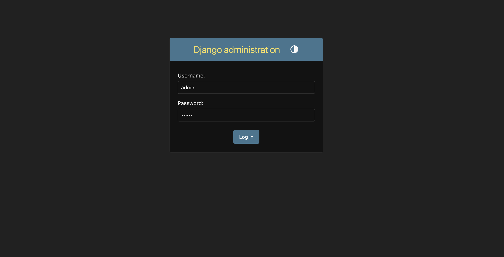

# 장고어드민 접속하기

장고는 관리자 페이지를 제공하는 프레임워크입니다.  

## 데이터베이스 마이그레이션 실행하기
django 프로젝트를 만들면 먼저 아래 명령어를 실행해야 합니다.  
```bash
python manage.py migrate
```

## 어드민 슈퍼유저 생성하기

어드민 페이지에 접근하려면, 슈퍼유저를 생성해야 합니다.  
아래 명령어로 슈퍼유저를 생성합니다.  

```bash
python3 manage.py createsuperuser
```
아래의 입력과 동일하게 입력해주세요
```bash
Username: test
Email address: test@test.com
Password: test
Password (again): test
The password is too similar to the username.
This password is too short. It must contain at least 8 characters.
This password is too common.
Bypass password validation and create user anyway? [y/N]: y
Superuser created successfully.
```
! password는 입력해도 터미널에 표시되지 않을뿐 입력되니 보이지 않아도 당황하지 마세요


## 어드민 페이지 사용하기

1. 장고 프로젝트 폴더에서 `python3 manage.py runserver` 명령어를 실행합니다.
2. 브라우저에서 `http://127.0.0.1:8000/admin/` 접속합니다.
3. 어드민 페이지에 접속합니다. 

정상적으로 접속되면 이와 같은 화면이 나옵니다.  
화면에 보이는 것처럼 `Username: test` 과 `Password: test` 을 입력하고 로그인합니다.  

4. 로그인 후 보이는 Users를 클릭하면 내가 추가한 슈퍼유저의 정보가 있는 것을 볼 수 있습니다.  
    눈치채셨겠지만, 위의 `python3 manage.py createsuperuser` 명령어 실행 후 적는 정보가 슈퍼유저의 정보입니다.  

## 직접 해보기
1. 본인 계정의 슈퍼유저를 추가해보세요
2. 본인 계정의 슈퍼유저로 로그인해보세요
3. `test` 계정을 삭제해보세요
4. `test` 계정으로 로그인 시도해보세요. 실패할 것입니다.