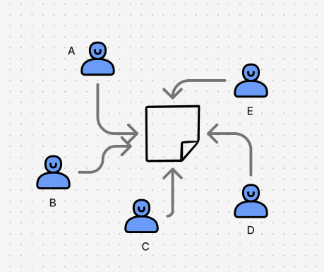
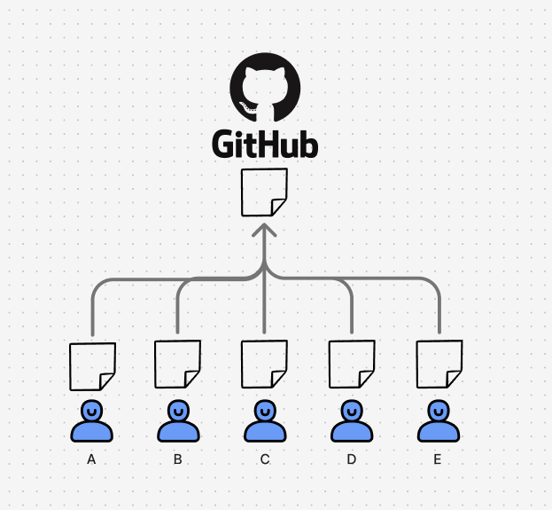

# git 배우기

> # git이란?

  
하나의 워드파일에 대해 5명이 같이 작업하면 어떻게 될까요?
- A: 서론
- B: 본문
- C: 결론
- D: 참고문헌
- E: 참고문헌

이렇게 되면 D와 E의 참고문헌이 겹치게 됩니다.  
또한 B가 본문을 적다가 서론을 수정하면 A와 B의 서론이 겹치게 됩니다.  

워드파일은 한개이므로 여러 사용자가 동시에 수정하면 문제가 발생합니다.  
이런 문제를 해결하기 위해 git을 사용합니다.  

  
#### git을 사용하면 각자의 사용자가 본인의 컴퓨터에서 작업을 하고,  작업한 내용을 중앙 저장소에 저장합니다.  

> # 용어 설명
- 깃(git): 프로젝트를 관리하는 도구
    - 예: 워드파일의 버전 관리 도구
- 깃허브(github): 깃이라는 도구를 이용하여 저장소를 저장하는 공간(웹사이트)
    - 예: 구글 드라이브
- 저장소(repository): 프로젝트를 저장하는 공간
    - 예: 구글 드라이브의 폴더


> # git 설치

git을 사용하기 위해서는 먼저 git을 설치해야 합니다.  

### 설치 방법
아래 명령어를 터미널에 입력하면 **Homebrew**(맥용 패키지 관리자)와 함께 Git이 설치됩니다.  
```bash
/bin/bash -c "$(curl -fsSL https://raw.githubusercontent.com/Homebrew/install/HEAD/install.sh)"
```

### 설치 확인
설치가 끝나면 버전을 확인해 봅시다.  
```bash
git --version
```

### 설정 방법
아래 명령어로 **커밋 서명 정보**(작성자)를 등록합니다.  
이메일은 GitHub 계정에 등록된 이메일을 사용해야 내 기여 기록에 반영됩니다.

```bash
git config --global user.name  "홍길동"        # 커밋에 찍힐 이름
git config --global user.email "hong@github.io" # 커밋에 찍힐 이메일
```

> # 사용해보기
1. GitHub에 로그인 후 오른쪽 상단 **프로필 → Your repositories → New** 클릭  
2. 생성할 저장소의 정보를 입력합니다.  

  

- Repository name: 저장소 이름
- Description: 저장소 설명
- Public: 저장소 공개 여부
3. Create repository 버튼을 클릭합니다. 
    - (이 단계까지 왔다면 구글 드라이브의 폴더가 생성됐다고 생각하면 됩니다.)  


#### 이제 내 로컬 컴퓨터의 파일을 생성한 리포지토리에 올려봅시다
**1. [이전 섹션](/backend-1hour/command?id=%ED%94%84%EB%A1%9C%EC%A0%9D%ED%8A%B8-%ED%8F%B4%EB%8D%94-%EB%A7%8C%EB%93%A4%EA%B8%B0)에서 생성한 `Users/{사용자 이름}` 폴더로 이동합니다.**

```bash
cd ~/Users/{사용자 이름}
```
**2. 리포지토리에 연결할 폴더를 생성합니다.**

```bash
mkdir my-first-repository
```
**3. 생성한 폴더로 이동합니다.**

```bash
cd my-first-repository
# vscode 실행
code .
```

**4. 현재 폴더를 Git으로 초기화합니다.**  
```bash
git init
# 예시 출력: Initialized empty Git repository in /Users/kim/my-first-repository/.git/
```

**5. GitHub 저장소(remote)를 등록합니다.**  
`origin` 은 “원격 저장소 별명”일 뿐, 보통 이렇게 이름 짓습니다.
```bash
git remote add origin https://github.com/vkfkd1107/my-first-repository.git  # ← 자신의 URL 입력
git remote -v     # 등록 확인용 명령
```

!! vscode extension으로 Git Graph를 설치하도록 합시다  
  
CHANGES의 ... 버튼 왼쪽 아이콘 클릭  
  
명령어를 따라하면서 깃 그래프가 변동되는것을 시각적으로 확인해보세요  


**6. 임의의 파일을 생성해봅시다**

```bash
echo "Hello, World!" > first_repository.txt
```
**7. 업로드할 파일을 스테이징합니다.**  
```bash
git add first_repository.txt
git status    # 어떤 파일이 추가(staged)됐는지 확인
```
**8. 변경 내용을 설명하는 커밋 메시지를 작성합니다.**
```bash
git commit -m "첫 커밋: 인사말 추가"
```
**9.메시지 지정까지 완료했으니 깃허브에 올립니다.**  
`git push` 명령어로 깃허브에 올릴 수 있습니다.  

```bash
git push origin main
```
**10. 누군가가 리포지토리의 프로젝트에서 작업을했다면, 그 작업을 내 컴퓨터에 받아오기 위해서 아래 명령어를 입력합니다.**  

```bash
git pull origin main
```

# branch
branch는 프로젝트를 버전별로 관리하는 방법입니다.  
브랜치 이름은 마음대로 지어도 되지만, 일반적으로 아래와 같이 사용합니다.  
- `main`: 운영서버에 배포되는 버전
- `staging`: 최종 테스트 서버에 배포되는 버전
- `dev`: 개발자들이 작업하는 버전
- 그 외 정의된 브랜치: 프로젝트의 특정 기능을 개발하는 브랜치
    - `feature/account`, `feature/payment`, `sprint/25-18/3`

아래 명령어를 입력하여 브랜치를 만들어줍니다.  
```bash
git branch {브랜치 이름}
```

### 1. `feature/test` 브랜치를 만들어서 github에 올려봅시다.
```bash
git branch feature/test
# 브랜치 이동
git checkout feature/test
```

### 2. `dev` 브랜치에 작업을 합쳐봅시다.
```bash
# 이 명령어를 실행하고 확인해보면 내가 feature/test 브랜치에서 작업한 내용이 안보이는 것을 확인할 수 있습니다
git checkout dev
```
1. 깃허브의 내 레포지토리에 갑니다.
2. pull request 탭 클릭
3. new pull request 버튼 클릭
4. create pull request 버튼 클릭
5. merge pull request 버튼 클릭

### 3. 내 로컬에서 `dev` 브랜치에 합친 작업이 반영되었는지 확인해봅시다.
```bash
git pull origin dev
```

# 주요 명령어 정리

- `git init`: 현재 폴더를 Git으로 초기화합니다.
- `git remote add origin {깃허브 저장소 주소}`: 깃허브 저장소를 등록합니다.
- `git add {파일명}`: 파일을 스테이징합니다.
- `git commit -m "{커밋 메시지}"`: 커밋 메시지를 작성합니다.
- `git push origin {브랜치 이름}`: 브랜치를 깃허브에 올립니다.
- `git pull origin {브랜치 이름}`: 브랜치를 깃허브에서 내려받습니다.
- `git branch {브랜치 이름}`: 브랜치를 만듭니다.
- `git checkout {브랜치 이름}`: 브랜치로 이동합니다.


# 직접 해보기
0. [강의 시청](https://codingapple.com/course/git-and-github/)
    - 위에 기재한 주요 명령어 부분만 봐도 충분합니다.
1. myself-repository 저장소를 만듭니다
2. myself branch에서 자기소개 파일을 만들어 깃허브에 올립니다
3. dev 브랜치를 만들어서 myself branch로 올린 작업을 합쳐봅시다
4. stage 브랜치를 만들어서 dev 브랜치로 올린 작업을 합쳐봅시다
5. main 브랜치에 stage 브랜치로 올린 작업을 합쳐봅시다
