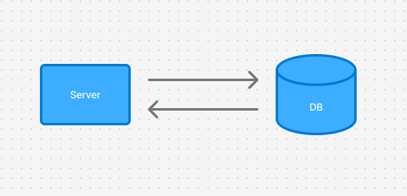
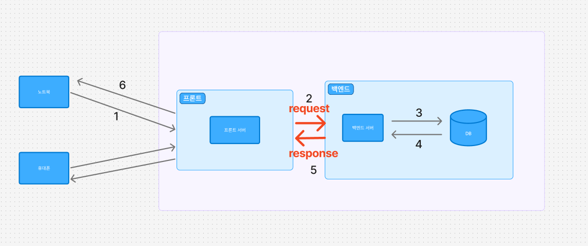

# 백엔드 작동원리

    
백엔드는 이 그림과 같이 데이터를 받아서 저장하고, 보여주는 역할을 합니다  

    
우리가 웹사이트로 접속하면, 위 그림의 과정을 거쳐서 화면이 보여집니다.  

(예시) 네이버 로그인
1. 노트북에서 네이버 로그인 페이지 접속
    - 1-1. 프론트 화면으로 그려진 로그인 페이지에 아이디와 비밀번호 입력
2. 백엔드 서버에 아이디와 비밀번호 전달
3. 백엔드 서버에서 DB에 해당 유저의 아이디와 비밀번호 있는지 확인 요청
4. DB에서 해당 유저를 찾아서 응답
5. 로그인 결과를 프론트 서버에 응답
6. 프론트에서 로그인 결과를 화면에 그려줌

# request
백엔드 서버는 request를 받아서, request안에 담긴 여러 정보를 확인할 수 있습니다
- 프론트에서 전달한 데이터(아이디, 비밀번호)
- 프론트에서 요청한 주소(https://naver.com/news/?page=3&count=50)
- 프론트에서 요청한 방법(GET, POST, PATCH,PUT, DELETE)
- 접속한 유저의 정보

# response
백엔드 서버가 프론트에 정보를 줄 때 response에 이런 정보들을 담아서 줍니다
- 프론트에 보여줄 데이터(로그인한 유저의 정보)
- 프론트에 보여줄 데이터의 형식(HTML, JSON, Excel, PDF, CSV 등)
- 백엔드 실패, 성공 결과: 프론트 개발자는 이 결과를 통해 프론트 화면에 어떻게 표시할지 결정할 수 있습니다
