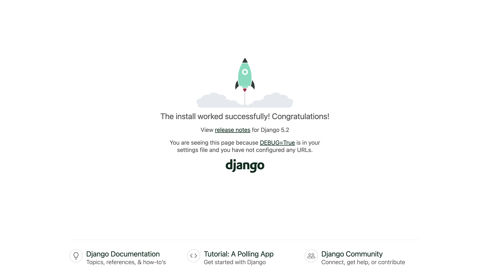

# 장고 서버 실행해보기
장고를 살펴보기 전에, 먼저 장고 서버를 실행해보겠습니다

## 0. 장고 설치
`Users/{사용자명}` 폴더에서 `my-first-django` 폴더를 만듭니다

```bash
cd ~/Users/{사용자명}
mkdir my-first-django
cd my-first-django
```
## 1. 가상환경 생성
### 가상환경이란?
프로젝트마다 독립적인 파이썬 환경을 만들어줍니다  
예를 들어 projectA, projectB, projectC가 있으면 

```
projectA/
├── venv/
├── projectA/
└── manage.py
|
projectB/
├── venv/
├── projectB/
└── manage.py
|
projectC/
├── venv/
├── projectC/
└── manage.py

```
아래와같이 다른 환경으로 프로젝트별 환경을 만들 수 있습니다

| 프로젝트 | 설치된 모듈 버전 |
|----------|-------------|
| projectA | `Django1`, `sentry-sdk1`, `lxml1`, `requests1`  |
| projectB | `Django2`, `sentry-sdk2`, `lxml2`, `requests2` |
| projectC | `Django3`, `sentry-sdk3`, `lxml3`, `requests3` |

`virtualenv [가상환경 이름]` 명령어를 사용하여 가상환경을 생성합니다
```bash
virtualenv venv
```

폴더 구조는 아래와 같습니다


```
my-first-django/
├── venv/
```

## 2. 가상환경 활성화
```bash
source venv/bin/activate
```
## 3. 장고 설치
```bash
pip install django
```

## 4. 장고 프로젝트 생성
장고 프로젝트를 생성합니다  
`django-admin startproject {프로젝트명}` 명령어를 사용합니다
```bash
django-admin startproject mysite
```
위 명령어로 `mysite`라는 장고프로젝트가 생성됩니다  
폴더 구조는 아래와 같습니다

```
my-first-django/
└── mysite/
    ├── manage.py
    └── mysite/
        ├── __init__.py
        └── settings.py
        └── urls.py
        └── wsgi.py
        └── asgi.py
```
## 5. 장고 서버 실행
`manage.py` 파일이 있는 디렉터리로 이동하여 서버를 실행합니다

```bash
python3 manage.py runserver
```

## 6. 장고 서버 접속

```bash
http://127.0.0.1:8000/
```

## 7. 이런 화면이 나오면 성공입니다

