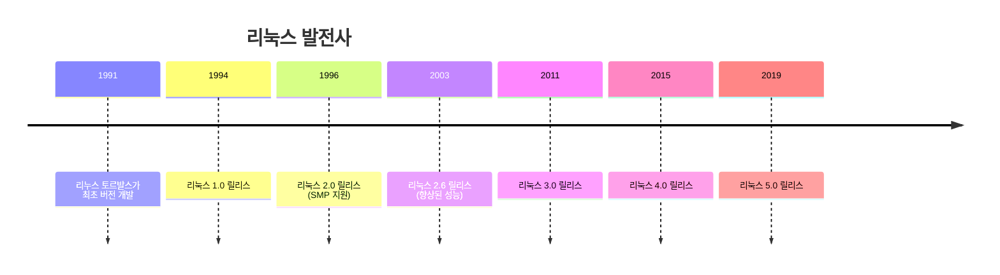

# 리눅스 정의

리눅스는 오픈소스 운영체제입니다.

## 특징

- 무료
- 오픈소스
- 안정성
- 보안성

아코디언 동작 확인용 페이지입니다.

## 🐧 리눅스 소개

리눅스는 **유닉스 계열**의 운영체제로, 전 세계 개발자들이 협력하여 개발하고 있는 **자유 소프트웨어**입니다.

### 📅 간단한 역사



## ✨ 리눅스의 특징

### 1. 🆓 오픈소스 (Open Source)
- **소스코드가 공개**되어 있어 누구나 확인 가능
- **무료로 사용** 가능
- **자유로운 수정과 배포** 허용

### 2. 👥 다중 사용자 (Multi-User)
```bash
# 현재 로그인한 사용자 확인
$ who
user1    tty1    2023-10-10 09:00
user2    pts/0   2023-10-10 10:30
user3    pts/1   2023-10-10 11:15
```

### 3. 🎯 다중 작업 (Multi-Tasking)
```bash
# 백그라운드에서 여러 작업 실행
$ program1 &
$ program2 &
$ program3 &
$ jobs    # 실행 중인 작업 확인
[1]  Running    program1 &
[2]  Running    program2 &
[3]  Running    program3 &
```

### 4. 🛡️ 안정성과 보안
- **메모리 보호** 기능
- **사용자 권한 관리**
- **강력한 보안 모델**

### 5. 📱 이식성 (Portability)
- 다양한 하드웨어 플랫폼 지원
- x86, ARM, MIPS, PowerPC 등

## 🌍 리눅스 배포판 (Distributions)

리눅스 커널을 기반으로 한 완전한 운영체제 패키지들입니다.

### 주요 배포판들

#### 1. 