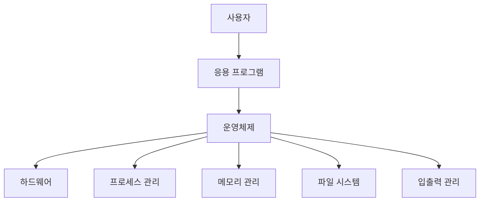

# 운영체제 정의

운영체제(Operating System)는 컴퓨터의 하드웨어와 소프트웨어를 관리하는 시스템입니다.

## 📝 개념

운영체제는 **하드웨어와 응용 프로그램 사이의 중간 계층**역할을 하며, 시스템의 모든 자원을 효율적으로 관리합니다.

## 🎯 주요 기능

1. 프로세스 관리
2. 메모리 관리
3. 파일 시스템 관리
4. 입출력 관리

## 💡 운영체제의 역할

?> **핵심 포인트**: 운영체제는 사용자와 하드웨어 사이의 **인터페이스**이자 **자원 관리자**입니다.

## 📚 운영체제의 종류

| 종류 | 예시 | 특징 |
|------|------|------|
| **Windows** | Windows 11, 10 | 사용자 친화적 GUI |
| **macOS** | Big Sur, Monterey | Apple 생태계 통합 |
| **Linux** | Ubuntu, CentOS | 오픈소스, 서버용 |
| **Unix** | Solaris, AIX | 기업용, 안정성 |
| **모바일** | Android, iOS | 터치 인터페이스 |

## 🔗 다음 단계

- [운영체제 구조](os/structure.md) - 운영체제의 내부 구조 살펴보기
- [프로세스와 스레드](os/process-thread.md) - 실행 단위에 대한 이해 

아코디언 테스트용 간단한 내용입니다. 